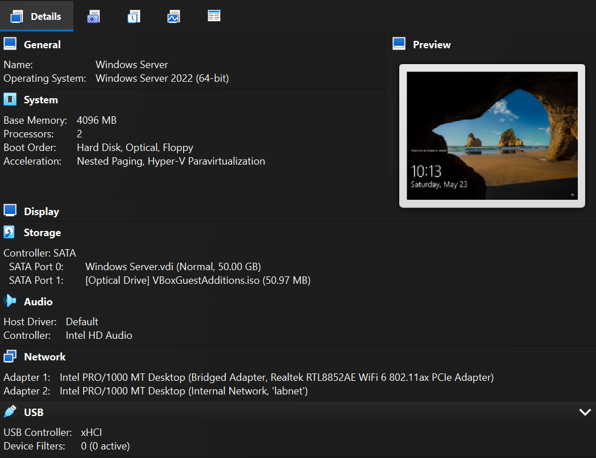
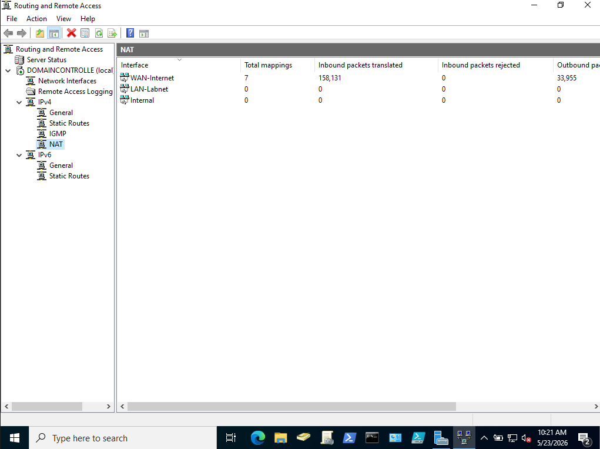
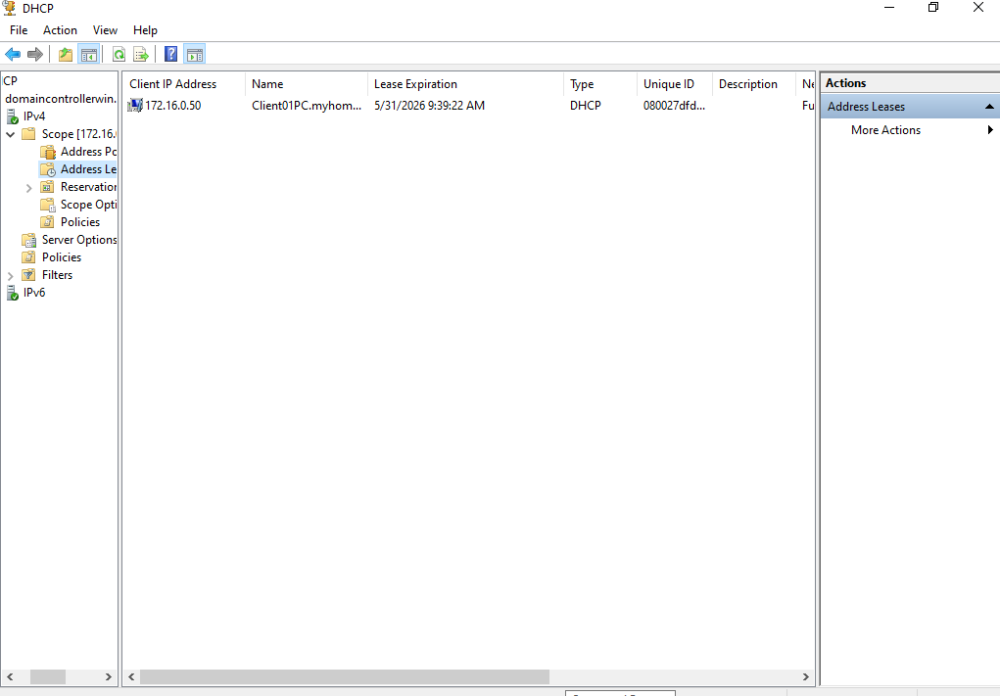
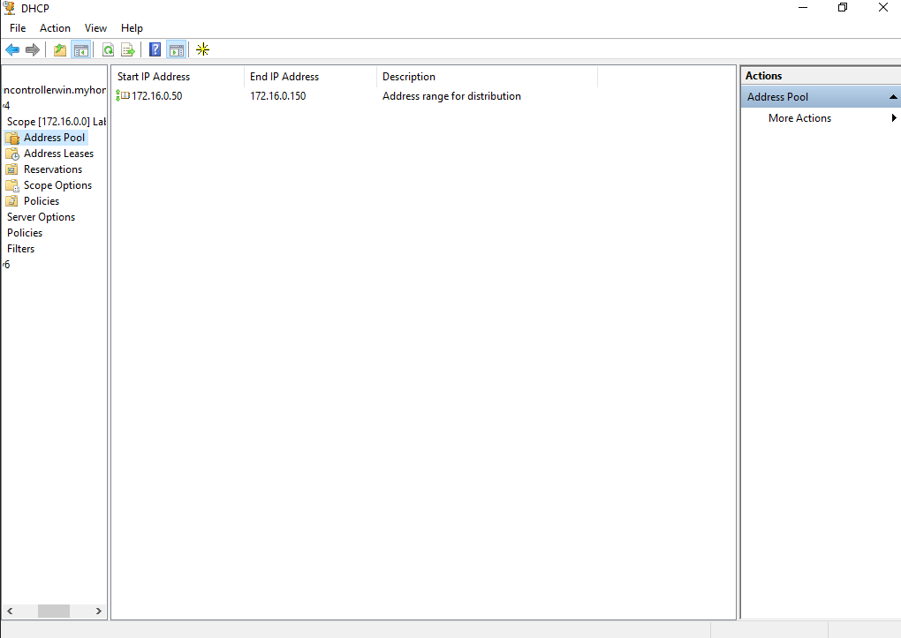
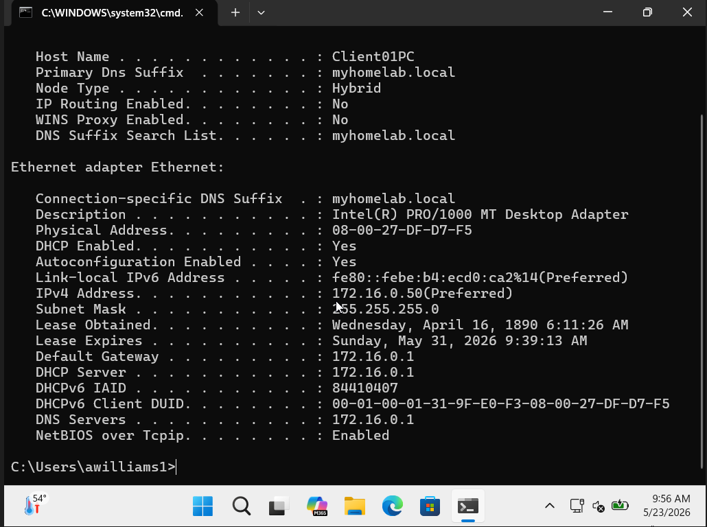
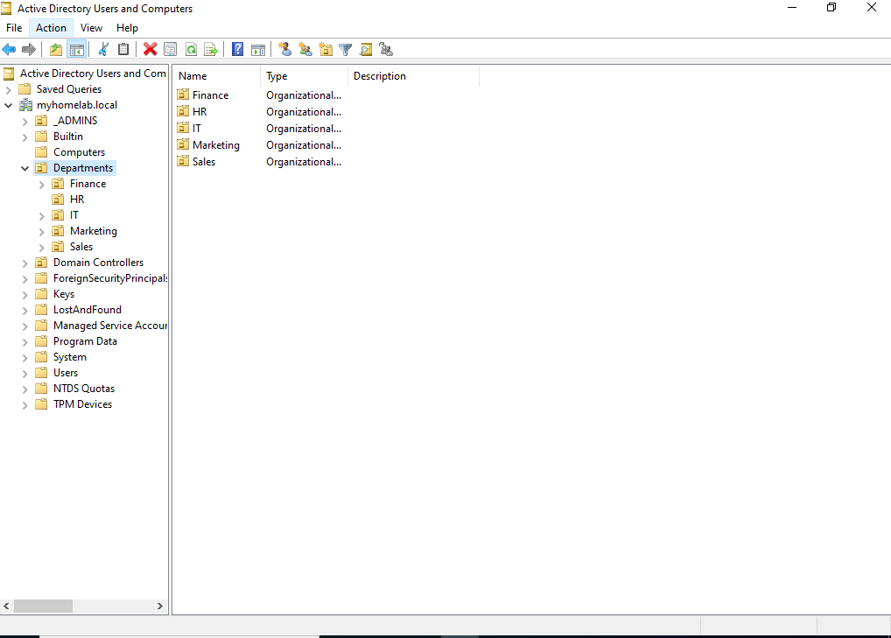
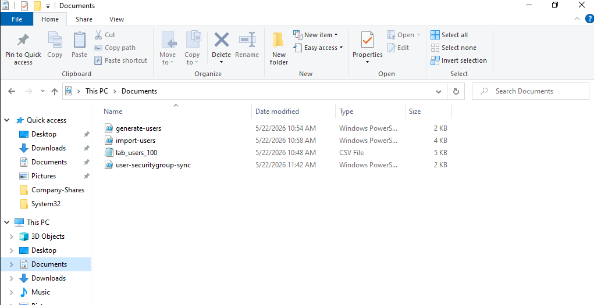

# Active Directory & Enterprise Endpoint Hardening Homelab

## Project Overview
This project demonstrates the deployment, configuration, and security hardening of a corporate-grade Active Directory (AD) environment. Built inside an isolated virtual network, this lab simulates real-world enterprise infrastructure; spanning network routing, automated identity management, centralized policy distribution, and defensive endpoint engineering. 

---

## Architectural Blueprint & Objectives
* **Isolated Core Infrastructure:** Configured an enterprise network topology utilizing VirtualBox internal networks bridged securely via a Windows Server NAT gateway.
* **Automated Identity Lifecycle:** Engineered and executed a custom PowerShell script to securely ingest and provision a multi-departmental corporate user directory.
* **Centralized Domain Management:** Implemented consolidated Group Policy Objects (GPOs) leveraging Item-Level Targeting (ILT) for efficient departmental drive mapping.
* **Defensive Endpoint Hardening:** Implemented application control via AppLocker policies to prevent untrusted binary execution and malicious software installation.
## Phase 1: Core Network Infrastructure & Routing

### 1. What Was Built
An isolated enterprise network environment utilizing a dual-homed Windows Server 2022 instance functioning as a core network router and NAT gateway, servicing a downstream Windows 11 enterprise workstation. 

| Asset | Hostname | Operating System | Network Interface 1 (WAN) | Network Interface 2 (LAN) | Primary Roles / Purpose |
| :--- | :--- | :--- | :--- | :--- | :--- |
| **Domain Controller** | `DomainControllerWIN` | Windows Server 2022 | DHCP (VirtualBox NAT) | Static: `172.16.0.1/24` | AD DS, DNS, DHCP, RRAS (NAT Router) |
| **Workstation** | `Client01PC` | Windows 11 Enterprise | *N/A (Isolated)* | Dynamic (DHCP Leased) | Endpoint Simulation & Policy Enforcement |

---

### 2. Objective (Why)
In a production enterprise environment, domain controllers and internal infrastructure nodes do not directly face the public internet due to threat exposure and the risk of unvetted external packet interaction. Furthermore, exposing a domain controller directly to a standard home router or bridged network fractures Active Directory's strict reliance on isolated private DNS. 

By building a custom **Routing and Remote Access Services (RRAS)** NAT gateway, the lab achieves a secure, modular topology. The internal Windows 11 workstation can safely fetch external resources (such as Windows Updates and administration tools) via address translation, while keeping internal corporate identity traffic and core DNS architecture entirely segmented from the physical home network.

---

### 3. Implementation (How)

To achieve strict isolation while preserving outbound translation, the core infrastructure was built using the following structural stages:

#### 📂 Step A: VirtualBox Virtual Network Architecture
1. Open Oracle VM VirtualBox and navigate to the settings pane for the **Windows Server 2022** VM.
2. Select **Network** and configure **Adapter 1**: Set the attachment type to `NAT` (or `Bridged`) to serve as the external Wide Area Network (WAN) interface.
3. Enable **Adapter 2**: Set the attachment type to `Internal Network` and name the software-defined switch `labnet` to serve as the private Local Area Network (LAN) backbone.
4. Navigate to the **Windows 11 Client** VM settings, select **Network**, and configure **Adapter 1** as `Internal Network` attached to the exact same `labnet` switch. Ensure no other adapters are enabled on the client to guarantee complete network isolation.



#### 📂 Step B: Server Interface Structuring & RRAS Virtual Router Installation
1. Log into the Windows Server 2022 instance, open `ncpa.cpl` via the run dialog, and rename the network adapters to `WAN` and `LAN` respectively to prevent operational confusion.
2. Right-click the `LAN` adapter, select **Properties -> IPv4**, and assign a static identity footprint: IP `172.16.0.1`, Subnet Mask `255.255.255.0`, and leave the Default Gateway blank (as this interface *is* the gateway).
3. Open **Server Manager**, click **Add Roles and Features**, and select **Remote Access**. Proceed through the wizard to install the **Routing** role service (which automatically includes DirectAccess and VPN/RRAS dependencies).
4. Once installed, open the **Routing and Remote Access** console. Right-click the server node and select **Configure and Enable Routing and Remote Access**.
5. Select **Network Address Translation (NAT)**, bind the external routing mechanism explicitly to the `WAN` interface, and click Finish to initialize packet forwarding.



#### 📂 Step C: Enterprise DHCP Scope Provisioning
1. Inside **Server Manager**, open the **DHCP** console tool.
2. Right-click **IPv4**, select **New Scope**, and define the administrative leasing parameters: Name the scope `Internal-Production-LAN` or any other appropriate name and configure the address pool allocation from `172.16.0.50` through `172.16.0.150`.
3. Configure the mandatory **Scope Options** required for automated corporate client domain alignment:
   * **Scope Option 003 (Router):** Set strictly to `172.16.0.1` (the Server's internal LAN IP).
   * **Scope Option 006 (DNS Servers):** Set strictly to `172.16.0.1` (or your domain controller's authoritative DNS identity node).
4. Right-click the newly authored scope and select **Activate**.




#### 📂 Step D: Downstream Client Stack Realignment
1. Boot up the Windows 11 workstation endpoint. Ensure its network interface adapter is verified to dynamically grab network configurations (`Obtain an IP address automatically`).
2. Open an elevated PowerShell or Command Prompt terminal window on the client machine.
3. Run `ipconfig /release` followed by `ipconfig /renew` to force a network stack flush and trigger an address allocation request across the internal switch.
4. Run `ipconfig /all` to verify that the workstation successfully leased an address from the server's scope, pulled `172.16.0.1` as its default gateway, and pointed back to the domain controller for its preferred DNS.



---

### 4. Troubleshooting & Roadblocks

#### The Routing Gateway Gap
* **The Issue:** Following the initial local domain authorization and internal switch configuration, the Windows 11 client workstation could authenticate internally but suffered a total outbound connectivity blackout, preventing connection to external web nodes or updates.
* **The Diagnosis:** Initiated a client-side network review via `ipconfig /all`. Discovered that while the client machine was picking up an internal IP address space, the interface default gateway was completely missing or misconfigured; pulling tracking metrics bound to the host computer's virtualization layer instead of routing through the Server's designated internal interface. 
* **The Resolution:** Remedied the data path inside the Windows Server DHCP console by verifying that **Scope Option 003 (Router)** was explicitly hardcoded and actively broadcasting `172.16.0.1`. Executed an elevated `gpupdate /force` and `ipconfig /renew` on the Windows 11 endpoint to clear out cached lease parameters. The endpoint successfully ingested the updated routing map, establishing stable, transparent Network Address Translation across the custom virtual gateway.

## Phase 2: Automated Identity Lifecycle & Directory Engineering

### 1. What Was Built
A three-stage automated Identity and Access Management (IAM) lifecycle pipeline within the `myhomelab.local` root domain. The infrastructure leverages modular PowerShell engineering to generate mock corporate data, programmatically provision departmental user identities, and dynamically synchronize Role-Based Access Controls (RBAC) across corresponding directory security groups.

| Engineering Stage / Script | Scope / Core Functional Utility | Input Source | Target Output / Action |
| :--- | :--- | :--- | :--- |
| **`generate-users.ps1`** | Data Pipeline Bootstrapping | Synthetic Header Maps | Generates `lab_users_100.csv` |
| **`import-users.ps1`** | Automated Directory Provisioning | `lab_users_100.csv` | Instantiates 100 AD User Objects across OUs |
| **`user-securitygroup-sync.ps1`** | RBAC Group Membership Sync | Active Directory Database | Enforces dynamic security group nesting |

---

### 2. Objective (Why)
Manual creation of user objects, directory containers, and permission assignments within an enterprise environment is inefficient, prone to human error, and completely unscalable. In a real-world enterprise, Identity Lifecycle Management must be programmatic, handling everything from hiring rushes to compliance-driven auditing.

The goal of this phase was to architect a production-grade identity pipeline using **PowerShell**. By creating a multi-tiered Organizational Unit (OU) taxonomy, automating user provisioning, and scripting security group synchronization, the lab simulates real-world enterprise operations. This ensures that 100 distinct identities conform strictly to naming conventions, land in the correct business units, and automatically receive proper group permissions without manual IT intervention.

---

### 3. Implementation (How)

#### 📂 Step A: Organizational Unit (OU) & Security Group Architecture Deployment
1. Log into your Domain Controller (`DomainControllerWIN`), open **Server Manager**, click **Tools**, and select **Active Directory Users and Computers (ADUC)**.
2. Click **View** in the top menu bar and ensure **Advanced Features** is enabled to expose hidden system containers.
3. Right-click the root domain node (`myhomelab.local`), select **New -> Organizational Unit**, and name it `Departments`or whatever name of your choice.
4. Right-click the `Departments` container, and sequentially create individual sub-OUs for each corporate business unit: ,`Finance`, `HR`, `IT`, `Marketing`, `Sales`and any other appropriate business unit.
5. Right-click any individual sub-OU that was created, select **New -> Group**, keep the following selections as is; Group Scope: **Global** and Group Type: **Security**, name the group something such as `GG-Finance-Users` or `GG-Marketing-Users` or whichever way you prefer.



#### 📂 Step B: Environment & Source Directory Setup
1. All automation components are maintained within the system directory path: `C:\Users\Administrator\Documents\`. (You can choose to save the automation components wherever you want.)
2. Open **Windows PowerShell ISE** as an Administrator on the Domain Controller to manage and run the script pipeline.


#### 📂 Step C: Executing the 3-Stage Automation Pipeline

##### Stage 1: Dataset Generation (`generate-users.ps1`)
This script bootstraps the process by programmatically generating your 100 random corporate identities, creating standard headers, assigning random departmental tags, and exporting the results into a flat file.

1. On the top left of **Windows PowerShell ISE** click **Open Script** and select the file `generate-users.ps1`
2. Once the script has been opened navigate to the green arrow near the top center and click **Run Script**

```powershell
# Executing this script outputs your local corporate data file:
C:\Users\Administrator\Documents\lab_users_100.csv
```
##### Stage 2: Identity Account Provisioning (`import-users.ps1`)
This script parses the generated CSV, normalizes user attributes, builds standardized lowercase `samAccountNames` (e.g., `first.last`), applies a secure baseline password, and handles OU routing.

1. Open the `import-users.ps1` script and execute it in **Windows PowerShell ISE**
```powershell
# Run the deployment script to ingest data and build Active Directory objects
.\import-users.ps1
```
##### Stage 3: Role-Based Security Group Sync (`user-securitygroup-sync.ps1`)
To ensure compliance with the Principle of Least Privilege, this script audits users across the newly populated OUs and automatically synchronizes them into corresponding Security Groups (e.g., `GG-IT-Users`, `GG-Sales-Users`) for resource access control.

1. Open the `users-securitygroup-sync` to run the synchronization script to bind memberships dynamically:

```powershell
# Run the RBAC syncing tool to automatically update security group memberships
.\user-securitygroup-sync.ps1
```
