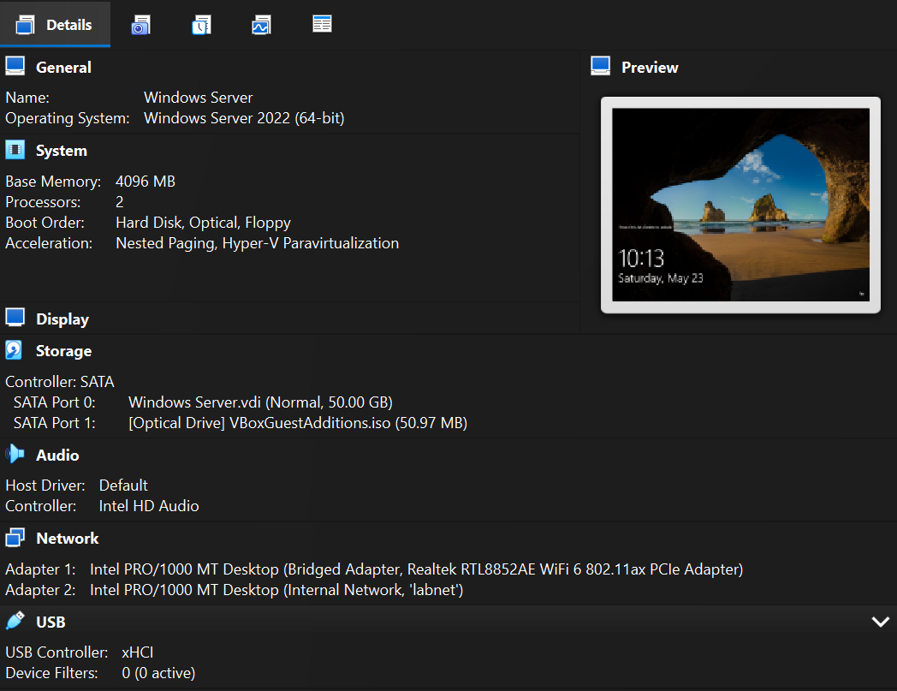
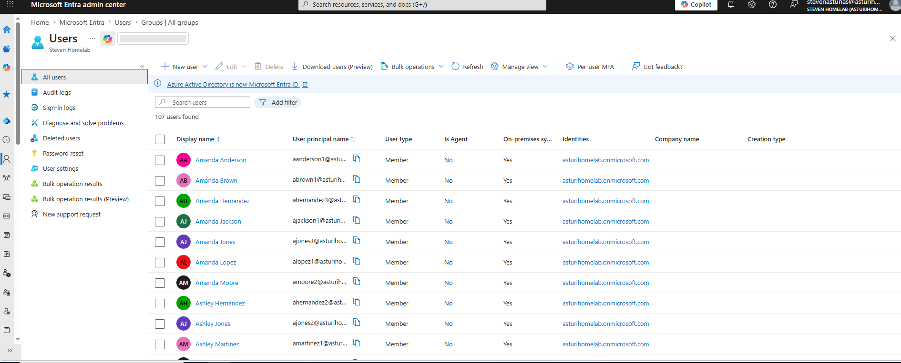

# Enterprise Systems Administration Lab

A self-directed homelab project demonstrating the end-to-end design, deployment, and administration of an enterprise Windows infrastructure — from bare hypervisor to hybrid cloud identity, centralized policy, and layered security monitoring.

Built in an isolated virtual network, the lab mirrors how real IT teams layer an environment: provision the infrastructure, automate identity management, enforce policy centrally, then add visibility and detection on top.

## Repository Structure

```
enterprise-systems-administration-lab/
├── README.md                           # Unified project overview (this file)
├── 01-windows-infrastructure/
│   └── README.md                       # Phase 1 detailed documentation
├── 02-hybrid-identity-security/        # Phase 2: hybrid identity + security
│   ├── README.md                       # Phase 2 detailed documentation
│   └── assets/documentation/           # Phase 2 screenshots
├── assets/screenshots/                 # Phase 1 screenshots
└── scripts/                            # PowerShell automation (user provisioning, RBAC sync)
```

## Lab Progression

| Phase | Focus | Key Technologies |
| :--- | :--- | :--- |
| **01 — Windows Infrastructure** | Virtualized domain environment: Windows Server 2022 DC + Windows 11 endpoint, AD DS, DNS, DHCP, RRAS NAT routing, automated provisioning of 100 AD users via PowerShell, OU/RBAC design, Group Policy (password & lockout policies, ILT drive mapping, AppLocker, admin restrictions) | VirtualBox, Windows Server 2022, Windows 11, AD DS, DNS, DHCP, RRAS, PowerShell, GPO, AppLocker |
| **02 — Hybrid Identity & Security** | Hybrid identity sync to Microsoft Entra ID via Entra Connect (Password Hash Sync), Wazuh SIEM on Ubuntu/Docker with Windows Event Log collection, Microsoft Defender for Endpoint onboarding via GPO, PingCastle AD auditing, BloodHound/SharpHound attack-path analysis | Microsoft Entra ID, Entra Connect, Wazuh, Ubuntu Server, Docker, Defender for Endpoint, PingCastle, BloodHound |

## Infrastructure Overview

- **Domain Controller** — `DomainControllerWIN` (Windows Server 2022): AD DS, DNS, DHCP, RRAS NAT gateway for `myhomelab.local`
- **Workstation** — `Client01PC` (Windows 11 Enterprise): domain-joined endpoint, policy enforcement target
- **Security host** — `Sec-Lab-01` (Ubuntu Server 22.04): Docker host for the Wazuh SIEM stack and BloodHound
- **Identity pipeline** — PowerShell scripts generate 100-user CSV data, provision AD accounts into departmental OUs (Finance, HR, IT, Marketing, Sales), and sync RBAC security group membership





## Detailed Documentation

Each phase is documented in full — including implementation steps, verification, and a troubleshooting log of real issues encountered (DHCP gateway misconfiguration, Group Policy propagation delays, AppLocker conflicts, Wazuh agent SSL failures, SIEM storage crashes):

- [01-windows-infrastructure/README.md](01-windows-infrastructure/README.md)
- [02-hybrid-identity-security/README.md](02-hybrid-identity-security/README.md)

## Disclaimer

This is a self-built lab environment for learning and skills demonstration. It is not production infrastructure and was never connected to a real organization's network.
